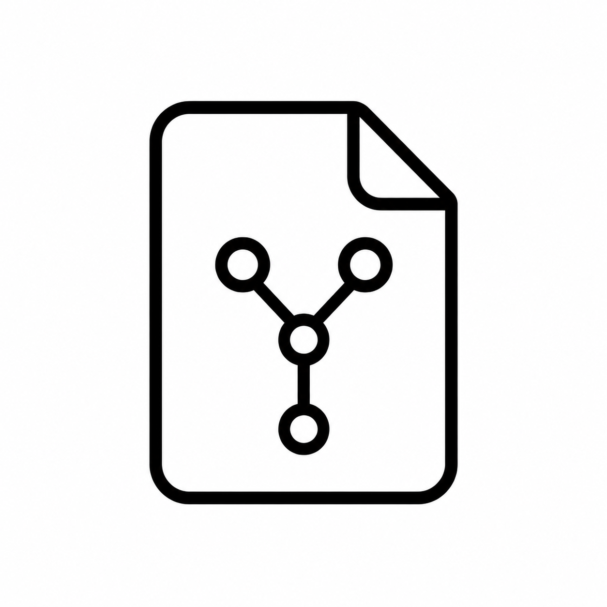
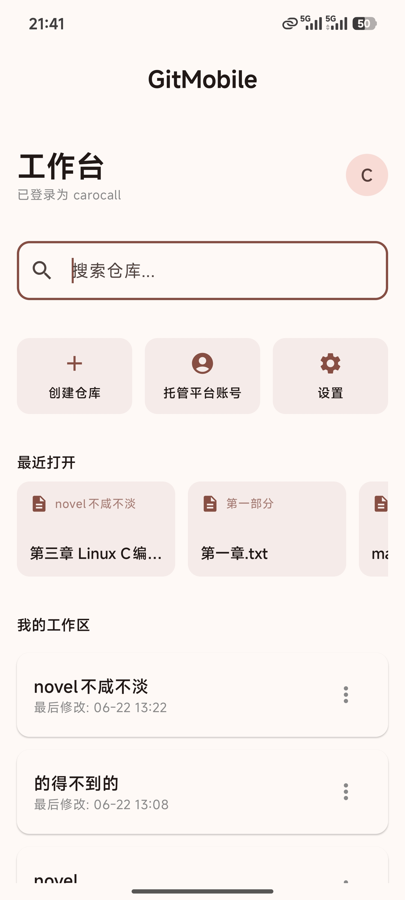
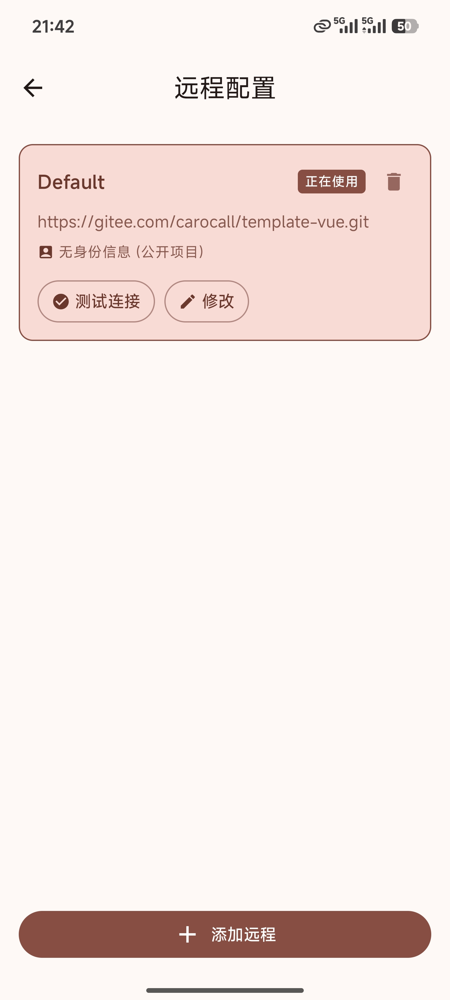
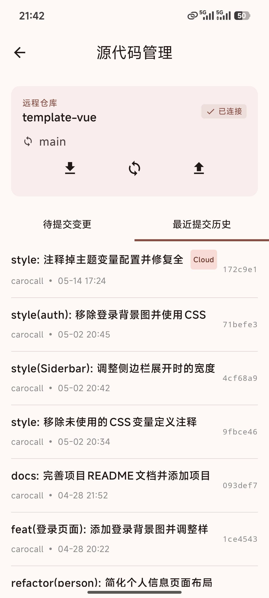
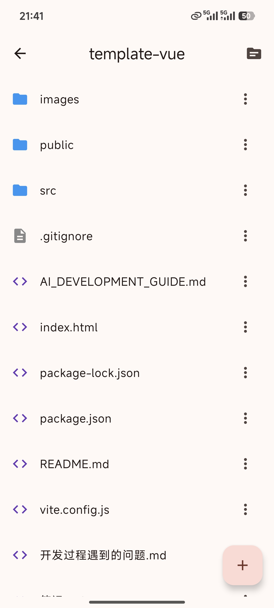
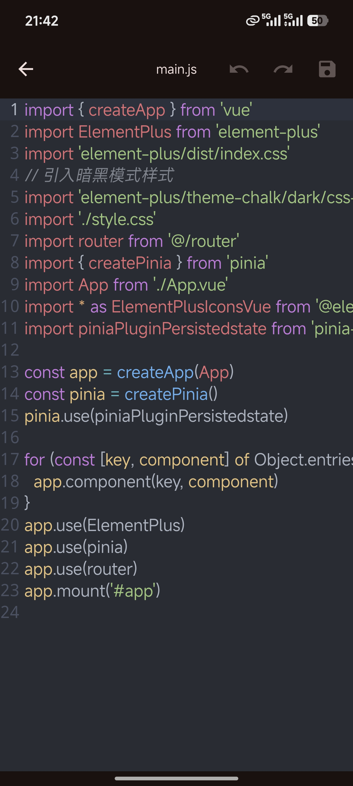

# GitMobile

### 现代、轻量级的 Android Git 客户端

基于 Jetpack Compose 开发 · 使用 JGit 引擎 · 专为移动设备优化

---

GitMobile 是一款基于 Jetpack Compose 开发的现代、轻量级 Android Git 客户端。它利用 JGit 库提供强大的 Git 核心功能，并专为移动设备优化了操作体验。

## 界面预览

<table>
  <tr>
    <td align="center" width="50%"><b>首页工作台</b></td>
    <td align="center" width="50%"><b>远程仓库列表</b></td>
  </tr>
  <tr>
    <td align="center"></td>
    <td align="center"></td>
  </tr>
  <tr>
    <td align="center"><b>Git 核心操作</b></td>
    <td align="center"><b>文件浏览列表</b></td>
  </tr>
  <tr>
    <td align="center"></td>
    <td align="center"></td>
  </tr>
  <tr>
    <td align="center"><b>代码编辑器</b></td>
    <td align="center"><b>文本编辑器</b></td>
  </tr>
  <tr>
    <td align="center"></td>
    <td align="center"></td>
  </tr>
</table>

## 主要功能

*   **仓库管理**：
    *   克隆远程仓库 (支持 HTTPS)。
    *   初始化本地仓库。
    *   导入设备上已有的 Git 仓库。
*   **Git 核心操作**：
    *   **拉取 (Pull)**、**推送 (Push)** 与 **获取 (Fetch)**。
    *   **一键同步 (Sync)**：自动执行拉取后推送，简化移动端操作流程。
    *   **提交 (Commit)**：支持选择性暂存文件并提交。
    *   **撤销 (Discard)**：快速回退未提交的修改。
*   **分支与标签管理**：
    *   查看本地与远程分支。
    *   创建、切换与删除分支。
    *   检出特定的提交或标签。
*   **历史与差异查看**：
    *   浏览详细的提交历史。
    *   查看单次提交中变更的文件列表。
    *   查看文件 Diff，掌握每一行代码的变动。
*   **高级功能**：
    *   **拣选 (Cherry-pick)** 提交。
    *   **回退 (Revert)** 提交。
    *   为提交添加标签 (Tag)。
*   **认证与多配置**：
    *   支持用户名/密码及 Token 认证。
    *   **远程配置文件 (Profiles)**：可保存多个身份配置，方便在不同平台（如 GitHub/Gitee）间快速切换。
*   **冲突检测**：
    *   实时检测合并冲突、合并中 (Merging) 及变基 (Rebasing) 状态。
*   **内置全能查看与编辑器**：
    *   **代码编辑器**：支持超过 40 种编程语言的语法高亮与编辑。
    *   **小说 (TXT) 编辑器**：专为移动端长文本阅读与修改优化的编辑器。
    *   **多媒体播放器**：内置视频与音频播放功能，无需跳转外部应用即可预览仓库素材。
    *   **图片查看器**：支持常见图片格式的快速预览。

## 快速入门

### 克隆远程仓库
1. 点击主界面右下角的 `+` 按钮。
2. 输入远程仓库 URL。
3. 如果需要认证，输入您的用户名与 Token/密码。
4. 点击 **Clone** 即可。

### 初始化本地仓库
1. 点击 `+` 按钮。
2. 选择 **Init Local**。
3. 指定本地目录并命名。

## 技术栈
*   **开发语言**：Kotlin
*   **UI 框架**：Jetpack Compose (Material 3)
*   **Git 引擎**：[JGit](https://www.eclipse.org/jgit/)
*   **异步处理**：Kotlin Coroutines

## 开源协议

本项目采用 **MIT** 协议。